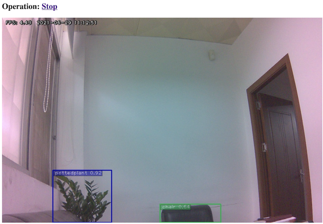

# README.md
## This project demos the camera video streaming from nvidia jetson nano/nx

keywords: nvidia nano; tensorrt; camera video streaming; yolov4; flask; jwt autentication



This project runs in jetson nano/xavier nx device with jetpack 4.5.1 and CSI camera installed. The camera captured video is sent to tensorrt version of yolov4 model, the output video is then streamed by flask.

you can watch the model's output video from: http://your_ip_addr:8000/start. the url is protected with jwt autentication. The authorized user can be created in users table in sqlite3 database users.db(see source code for table schema).

## build yolov4 model for tensorrt
download yolov4 pre-trained model yolov4.weights, renname to yolov4-416.weights and put it in yolo directory of this project, convert it to onnx format:
```
# from yolo directory:
python3 yolo_to_onnx.py -m yolov4-416
```

then convert the onnx format to tensorrt format:
```
python3 onnx_to_tensorrt.py -v -m yolov4-416
```
the generated model is yolov4-416.trt(in yolo directory)

## flask jwt authentication

in flask, a route is protected by authentication with:
```
@app.route("/")
@token_required
```
where:
```
app.config['SECRET_KEY']='YOUR_SECRET_KEY_HERE'
app.config['SQLALCHEMY_DATABASE_URI']='sqlite:///./users.db'
app.config['SQLALCHEMY_TRACK_MODIFICATIONS'] = True

def token_required(f):  
   @wraps(f)  
   def decorator(*args, **kwargs):
      # havent login 
      try:
         token = session["token"]
      except:
         return render_template('login.html')
      if 'x-access-tokens' in request.headers:  
         token = request.headers['x-access-tokens'] 

      if not token:
         #return jsonify({'message': 'a valid token is missing'})   
         return render_template('login.html')

      try: 
         data = jwt.decode(token, app.config['SECRET_KEY'])
         current_user = Users.query.filter_by(public_id=data['public_id']).first()  
      except Exception as e:
         print(f'exception message={str(e)}', file=sys.stdout)
         return render_template('login.html')

      return f(current_user, *args,  **kwargs)  
   return decorator 
```

If unthorized user access route /, then will be redirected to login.html, after successful authentication, the access token is stored in session for later use.

In /login method, the username/password taken from form data are compared with the encoded name/password in table users.
